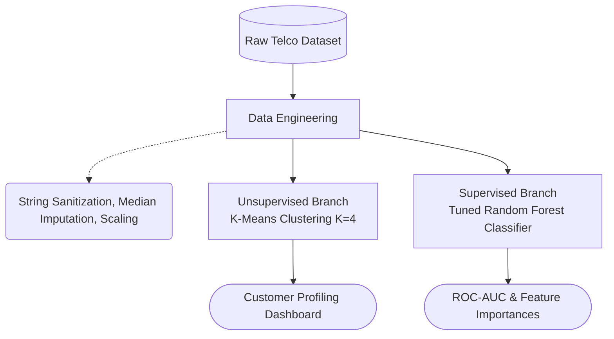

# System Architecture Diagram

```mermaid
graph TD
    A[(Raw Telco Dataset)] --> B[Data Engineering]
    B -.-> C(String Sanitization, Median Imputation, Scaling)
    B --> D[Unsupervised Branch<br>K-Means Clustering K=4]
    B --> E[Supervised Branch<br>Tuned Random Forest Classifier]
    
    D --> F([Customer Profiling Dashboard])
    E --> G([ROC-AUC & Feature Importances])
```
